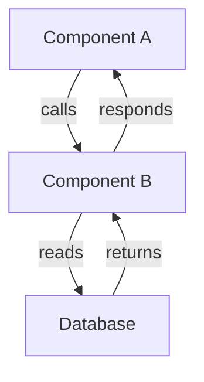
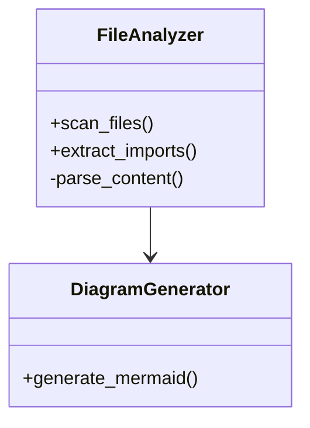
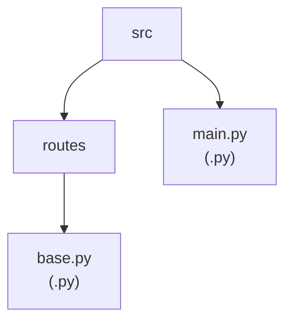
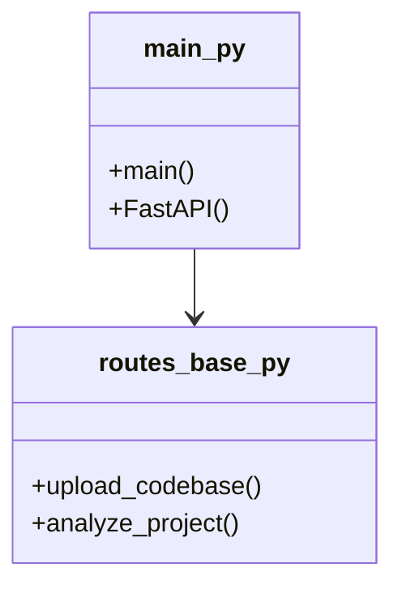
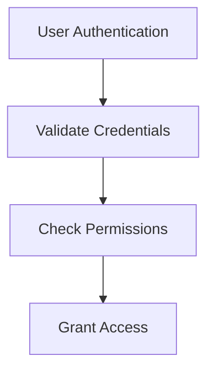
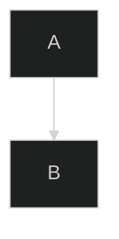

# Skill: Mermaid Diagram Generation & Architecture Visualization

Expertise in generating Mermaid diagrams that represent code structure, dependencies, and data flows. Includes diagram optimization, rendering troubleshooting, and architecture pattern visualization.

## Overview

The analyzer generates 4 types of Mermaid diagrams from scanned codebase metadata:
1. **Component Diagram** — File structure and modules
2. **Class Diagram** — Exported symbols and relationships
3. **Dependency Diagram** — Import connections
4. **Flowchart Diagram** — Data flow visualization

All diagrams in `services/python-fast-api/src/routes/base.py` → `_generate_*_diagram(files, ai_insights)`.

---

## Mermaid Syntax Basics

### Flowchart (Most Common)


### Class Diagram


### Graph (Dependency)


---

## Component Diagram Generation

### Pattern
```python
def _generate_component_diagram(files: list[dict], ai_insights: dict = None) -> str:
    """
    Generate Mermaid diagram showing file structure and modules.
    Groups files by directory to show hierarchy.
    """
    lines = ["graph TB"]  # Top-bottom layout
    
    # Extract directories
    dirs = set()
    for f in files:
        path_parts = f["file_path"].split("/")
        for i in range(len(path_parts)):
            dirs.add("/".join(path_parts[:i+1]))
    
    # Create nodes for each directory and file
    for d in sorted(dirs):
        clean_name = d.replace("/", "_").replace(".", "_")
        label = d.split("/")[-1] or "root"
        lines.append(f'    {clean_name}["{label}"]')
    
    # Add file nodes
    for f in files:
        file_id = f["file_path"].replace("/", "_").replace(".", "_").replace("-", "_")
        file_name = f["file_path"].split("/")[-1]
        lines.append(f'    {file_id}["{file_name}<br/>({f["file_type"]})"]')
        
        # Connect file to parent directory
        parent = "/".join(f["file_path"].split("/")[:-1])
        if parent:
            parent_id = parent.replace("/", "_").replace(".", "_")
            lines.append(f'    {parent_id} --> {file_id}')
    
    # Add AI-enhanced metadata
    if ai_insights:
        lines.append(f'    style root fill:#e1f5ff')
    
    return "\n".join(lines)
```

### Best Practices
1. **Hierarchy:** Use directory nesting with `-->` to show structure
2. **Labels:** Include file extension in label for clarity
3. **Node IDs:** Sanitize names (remove `/`, `.`, `-`) to create valid IDs
4. **Complexity Limit:** Keep diagrams under 30 nodes for readability
5. **Colors:** Use `style` to highlight key components or AI-detected patterns

### Example Output


---

## Class Diagram Generation

### Pattern
```python
def _generate_class_diagram(files: list[dict], ai_insights: dict = None) -> str:
    """
    Generate Mermaid class diagram showing exported classes and functions.
    Shows relationships between modules.
    """
    lines = ["classDiagram"]
    
    # Create class entries for each file with exports
    for f in files:
        if not f["exported_items"]:
            continue
        
        class_name = f["file_path"].replace("/", "_").replace(".", "_")
        lines.append(f"    class {class_name}{{")
        
        # Add exported items as members
        for item in f["exported_items"][:10]:  # Limit to 10 per class
            lines.append(f"        +{item}()")
        
        lines.append("    }")
    
    # Add relationships based on imports
    edges = set()
    for f in files:
        if not f["imported_items"]:
            continue
        
        from_id = f["file_path"].replace("/", "_").replace(".", "_")
        for imp in f["imports"][:5]:  # Limit relationships
            # Try to match import to a file/module
            to_id = imp.replace("/", "_").replace(".", "_").replace("-", "_")
            edges.add((from_id, to_id))
    
    for from_id, to_id in edges:
        lines.append(f"    {from_id} --> {to_id}")
    
    # AI enhancements: highlight key classes
    if ai_insights and ai_insights.get("main_components"):
        for comp in ai_insights["main_components"][:3]:
            comp_id = comp.replace(" ", "_").lower()
            lines.append(f"    style {comp_id} fill:#fff3e0")
    
    return "\n".join(lines)
```

### Best Practices
1. **Class Names:** Sanitize file paths to valid class names
2. **Member Limit:** Show only top 10 exports per class (avoid clutter)
3. **Relationship Limit:** Cap edges to prevent tangled diagrams
4. **Visibility:** Use `+` for public, `-` for private in method names
5. **AI Coloring:** Highlight AI-detected "main_components" with distinct colors

### Example Output


---

## Dependency Diagram Generation

### Pattern
```python
def _generate_dependency_diagram(files: list[dict], ai_insights: dict = None) -> str:
    """
    Generate diagram showing import relationships (dependency graph).
    Shows what imports what for quick understanding of module coupling.
    """
    lines = ["graph LR"]  # Left-to-right is natural for dependencies
    
    # Collect all imports and files
    node_ids = set()
    edges = []
    
    for f in files:
        from_id = f["file_path"].split("/")[-1].replace(".", "_")
        node_ids.add(from_id)
        lines.append(f'    {from_id}["{from_id}"]')
        
        for imp in f["imports"][:5]:  # Limit to avoid clutter
            # Simplify import names
            imp_clean = imp.split("/")[-1].split(".")[-1]
            to_id = imp_clean.replace("-", "_").replace(".", "_")
            
            if to_id != from_id:  # Avoid self-loops
                edges.append((from_id, to_id))
    
    # Add edges with labels
    for from_id, to_id in sorted(set(edges)):
        lines.append(f"    {from_id} -->|imports| {to_id}")
    
    # Highlight critical paths if AI analysis available
    if ai_insights and ai_insights.get("data_flows"):
        for flow in ai_insights["data_flows"][:2]:  # Top 2 flows
            start = flow.get("start", "").split("/")[-1].replace(".", "_")
            end = flow.get("end", "").split("/")[-1].replace(".", "_")
            lines.append(f"    style {start} fill:#c8e6c9")
            lines.append(f"    style {end} fill:#c8e6c9")
    
    return "\n".join(lines)
```

### Best Practices
1. **Simplify Import Names:** Extract module name only (ignore paths)
2. **Avoid Self-Loops:** Don't show `A --> A`
3. **Edge Labels:** Use labels like `imports`, `calls`, `depends-on`
4. **Flow Highlighting:** Color code data flow start/end nodes
5. **Direction:** Left-to-right `LR` reads more naturally for dependencies

### Example Output


---

## Flowchart Diagram Generation

### Pattern
```python
def _generate_flowchart_diagram(files: list[dict], ai_insights: dict = None) -> str:
    """
    Generate flowchart showing primary data flow paths through the system.
    Uses AI insights to identify main execution flows.
    """
    lines = ["graph TD"]
    
    if ai_insights and ai_insights.get("data_flows"):
        # Build flowchart from AI-detected data flows
        flows = ai_insights["data_flows"]
        node_counter = {}
        
        for flow in flows[:3]:  # Show top 3 flows
            flow_name = flow.get("name", "Flow").replace(" ", "_")
            start = flow.get("start", "")
            end = flow.get("end", "")
            steps = flow.get("steps", [])
            
            # Create start node
            if start:
                start_id = f"{flow_name}_start"
                lines.append(f'    {start_id}["{start}"]')
                prev_id = start_id
            
            # Create step nodes
            for i, step in enumerate(steps[:5]):  # Limit steps
                step_id = f"{flow_name}_step{i}"
                lines.append(f'    {step_id}["{step}"]')
                lines.append(f"    {prev_id} --> {step_id}")
                prev_id = step_id
            
            # Create end node
            if end:
                end_id = f"{flow_name}_end"
                lines.append(f'    {end_id}["{end}"]')
                lines.append(f"    {prev_id} --> {end_id}")
    else:
        # Fallback: simple entry-to-exit flow
        lines.append('    ENTRY["Upload Codebase"]')
        lines.append('    SCAN["Scan Files"]')
        lines.append('    EXTRACT["Extract Imports/Exports"]')
        lines.append('    DIAGRAM["Generate Diagrams"]')
        lines.append('    DISPLAY["Display Results"]')
        lines.append("    ENTRY --> SCAN")
        lines.append("    SCAN --> EXTRACT")
        lines.append("    EXTRACT --> DIAGRAM")
        lines.append("    DIAGRAM --> DISPLAY")
    
    return "\n".join(lines)
```

### Best Practices
1. **AI-Driven:** Prioritize AI-detected flows if available
2. **Step Limit:** Show max 5 steps per flow (readability)
3. **Node Naming:** Use readable labels, avoid technical jargon
4. **Fallback:** Provide generic fallback if AI unavailable
5. **Direction:** Top-down `TD` works well for process flows

### Example Output


---

## Rendering in React

### MermaidDiagram Component
```typescript
export function MermaidDiagram({ content, title, className = '' }: MermaidDiagramProps) {
    const containerRef = useRef<HTMLDivElement>(null);
    const [svgContent, setSvgContent] = useState<string>('');
    const [error, setError] = useState<string>('');
    
    useEffect(() => {
        const renderDiagram = async () => {
            try {
                const svg = await mermaid.render('diagram', content);
                setSvgContent(svg.svg);
                setError('');
            } catch (err) {
                setError(`Failed to render: ${err.message}`);
                // Fallback: show raw Mermaid text
            }
        };
        
        renderDiagram();
    }, [content]);
    
    if (error) {
        return <div className={className}><pre>{content}</pre></div>;
    }
    
    return <div ref={containerRef} dangerouslySetInnerHTML={{ __html: svgContent }} />;
}
```

### Common Issues & Fixes

| Issue | Cause | Fix |
|-------|-------|-----|
| Blank diagram | Syntax error in Mermaid | Validate syntax; show raw text |
| Node names duplicated | ID collision | Sanitize IDs with unique counters |
| Diagram too large | Too many nodes/edges | Filter; show top N items |
| Missing arrows | Invalid syntax | Ensure `-->`, `-->|label|` format |
| Rendering slow | Large diagram (100+ nodes) | Simplify or paginate flows |

---

## Optimization Techniques

### Complexity Management
```python
# Limit nodes
files = files[:30]  # Cap at 30 files

# Limit imports/exports shown per file
for f in files:
    f["imports"] = f["imports"][:5]
    f["exported_items"] = f["exported_items"][:10]

# Avoid clutter
if len(edges) > 50:
    # Sample edges or show critical path only
    edges = sorted(edges, key=significance)[:50]
```

### Performance Metrics
```
Nodes: <30    | Render: ~100ms
Nodes: 30-100 | Render: ~300ms
Nodes: 100+   | Render: ~1000ms (consider splitting)
```

### Dark Mode Support


---

## Testing Mermaid Output

### Validation
```python
def test_generate_component_diagram():
    files = [
        {"file_path": "src/main.py", "file_type": ".py", ...},
        {"file_path": "src/utils.py", "file_type": ".py", ...},
    ]
    diagram = _generate_component_diagram(files)
    
    # Check syntax validity
    assert "graph" in diagram.lower()
    assert "-->" in diagram  # Has connections
    assert "main.py" in diagram
    
    # Render with mermaid CLI or online tool
    # mermaid test.mmd --output test.svg
```

### Live Testing
- Use [Mermaid Live Editor](https://mermaid.live) to test syntax
- Export as PNG/SVG for documentation
- Test responsive rendering on mobile

---

## AI-Enhanced Diagrams

### Adding AI Insights
```python
diagrams = {
    "component": _generate_component_diagram(files, ai_insights),
    "class": _generate_class_diagram(files, ai_insights),
    "dependency": _generate_dependency_diagram(files, ai_insights),
    "flowchart": _generate_flowchart_diagram(files, ai_insights),
}

# AI insights augment diagrams with:
# - Colored highlighting of main components
# - Data flow annotations
# - Architecture pattern descriptions
```

### Best Practices
1. Use AI to highlight "main_components" with unique colors
2. Use AI "data_flows" to color code critical paths
3. Add "architecture_pattern" as diagram subtitle
4. Include AI "quality_assessment" as diagram footer

---

## References
- [Mermaid Documentation](https://mermaid.js.org)
- [Mermaid Live Editor](https://mermaid.live)
- Code: `services/python-fast-api/src/routes/base.py` (diagram generation functions)
- React: `services/react-web-app/app/components/MermaidDiagram.tsx` (rendering)
